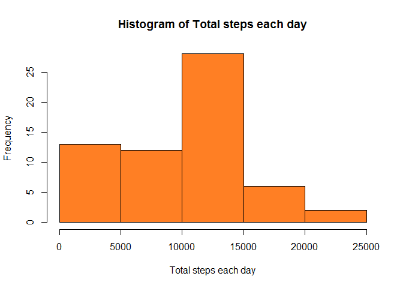
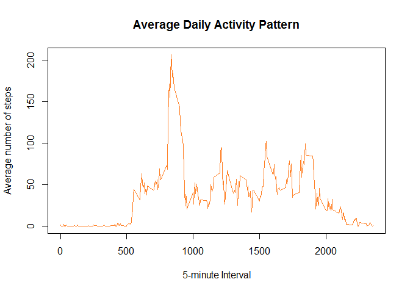
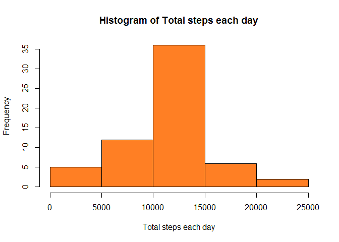
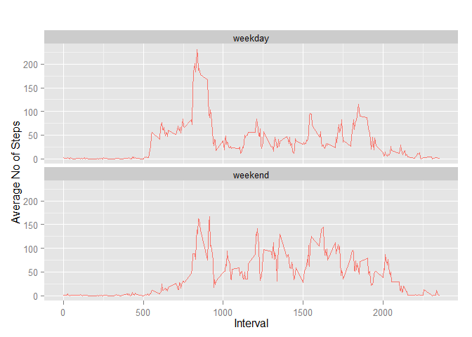

# Reproducible Research: Peer Assessment 1


## Loading and preprocessing the data

##### Reading the data into the 'activitydata' variable and showing the dimensions.


```r
activityData <- read.csv(unz("activity.zip", filename = "activity.csv"))
str(activityData)
```

```
## 'data.frame':	17568 obs. of  3 variables:
##  $ steps   : int  NA NA NA NA NA NA NA NA NA NA ...
##  $ date    : Factor w/ 61 levels "2012-10-01","2012-10-02",..: 1 1 1 1 1 1 1 1 1 1 ...
##  $ interval: int  0 5 10 15 20 25 30 35 40 45 ...
```

##### Processing data to give proper date format

```r
activityData$date <- as.Date(activityData$date)
str(activityData)
```

```
## 'data.frame':	17568 obs. of  3 variables:
##  $ steps   : int  NA NA NA NA NA NA NA NA NA NA ...
##  $ date    : Date, format: "2012-10-01" "2012-10-01" ...
##  $ interval: int  0 5 10 15 20 25 30 35 40 45 ...
```

## What is mean total number of steps taken per day?

##### Plotting the histogram of total steps taken each day

```r
totStepsEachDay <- aggregate(x = activityData$steps, by = list(activityData$date), FUN = sum, na.rm = TRUE)
names(totStepsEachDay) <- c("Date", "Total.Steps")
hist(x = totStepsEachDay$Total.Steps, main = "Histogram of Total steps each day", xlab = "Total steps each day", col = "chocolate1")
```

 

```r
meanSteps <- mean(totStepsEachDay$Total.Steps)
medianSteps <- median(totStepsEachDay$Total.Steps)
```

###### Mean of the total number of steps taken each day: 9354.2295082
###### Median of the total number of steps taken each day: 10395

## What is the average daily activity pattern?
##### Calculating the average number of steps taken based on the 5 min interval, across all days

```r
avgStepsInInterval <- aggregate(x = activityData$steps, by = list(activityData$interval), FUN = mean, na.rm = TRUE)
names(avgStepsInInterval) <- c("Interval", "Average.Steps")
```

##### Plotting Activity Daily Pattern

```r
plot(x = avgStepsInInterval$Interval, y = avgStepsInInterval$Average.Steps, type = "l", xlab = "5-minute Interval", ylab = "Average number of steps", main = "Average Daily Activity Pattern", col = "chocolate1")
```

 

##### Finding the 5-minute interval with maximum average steps taken across all days

```r
reqdInterval <- avgStepsInInterval[avgStepsInInterval$Average.Steps == max(avgStepsInInterval$Average.Steps),]$Interval
```

###### The 5-minute interval, on average across all the days in the dataset, with the maximum number of steps: 835 - 840

## Imputing missing values

##### Calculating the total number of missing values in the dataset

```r
countNA <- sum(!complete.cases(activityData))
```

Number of rows with missing values: 2304
 
##### Filling missing values with the mean for the respective 5-minute interval

```r
activityDataSansNA <- activityData
for (i in 1:nrow(activityDataSansNA)){
    if(is.na(activityDataSansNA[i, "steps"])){
        activityDataSansNA[i, "steps"] = 
            ceiling(avgStepsInInterval[avgStepsInInterval$Interval ==
                activityDataSansNA[i,"interval"],]$Average.Steps)
    }
}
```

Printing dimensions of the new dataset

```r
str(activityDataSansNA)
```

```
## 'data.frame':	17568 obs. of  3 variables:
##  $ steps   : num  2 1 1 1 1 3 1 1 0 2 ...
##  $ date    : Date, format: "2012-10-01" "2012-10-01" ...
##  $ interval: int  0 5 10 15 20 25 30 35 40 45 ...
```

##### Plotting the histogram of total number of steps taken each day after filling NA's

```r
totStepsEachDaySansNA <- aggregate(x = activityDataSansNA$steps, by = list(activityDataSansNA$date), FUN = sum, na.rm = TRUE)
names(totStepsEachDaySansNA) <- c("Date", "Total.Steps")
hist(x = totStepsEachDaySansNA$Total.Steps, main = "Histogram of Total steps each day", xlab = "Total steps each day", col = "chocolate1")
```

 

```r
meanSansNA <- mean(totStepsEachDaySansNA$Total.Steps)
medianSansNA <- median(totStepsEachDaySansNA$Total.Steps)
```

###### New mean of the total number of steps taken each day: 10784.9180328
###### New median of the total number of steps taken each day: 10909

###### Mean and median values have increased after filling the missing values.


```r
totStepsAllDays <- sum(totStepsEachDay$Total.Steps, na.rm = TRUE)
newTotStepsAllDays <- sum(totStepsEachDaySansNA$Total.Steps)
```
###### Increase in the total number of steps after imputing: 87272

## Are there differences in activity patterns between weekdays and weekends?

###### Adding variables to identify weekday and weekends

```r
activityDataSansNA$day <- weekdays(activityDataSansNA$date,abbreviate = TRUE)
activityDataSansNA$daytype[(activityDataSansNA$day == "Sun" | activityDataSansNA$day == "Sat")] <- "weekend"
activityDataSansNA$daytype[!(activityDataSansNA$day == "Sun" | activityDataSansNA$day == "Sat")] <- "weekday"
activityDataSansNA$daytype <- as.factor(activityDataSansNA$daytype)
```

Printing dimensions of the new dataset

```r
str(activityDataSansNA)
```

```
## 'data.frame':	17568 obs. of  5 variables:
##  $ steps   : num  2 1 1 1 1 3 1 1 0 2 ...
##  $ date    : Date, format: "2012-10-01" "2012-10-01" ...
##  $ interval: int  0 5 10 15 20 25 30 35 40 45 ...
##  $ day     : chr  "Mon" "Mon" "Mon" "Mon" ...
##  $ daytype : Factor w/ 2 levels "weekday","weekend": 1 1 1 1 1 1 1 1 1 1 ...
```

##### Plotting Activity Pattern across Weekends and Weekdays


```r
avgStepsInIntervalDayType <- aggregate(steps ~ interval+daytype, activityDataSansNA, mean)
library(ggplot2)
```

```
## Warning: package 'ggplot2' was built under R version 3.1.2
```

```r
qplot(interval, steps, data = avgStepsInIntervalDayType, geom = c("line"), xlab = "Interval", ylab = "Average No of Steps", col = "chocolate1", main="") + facet_wrap(~daytype, ncol = 1) + guides(colour=FALSE)
```

 
